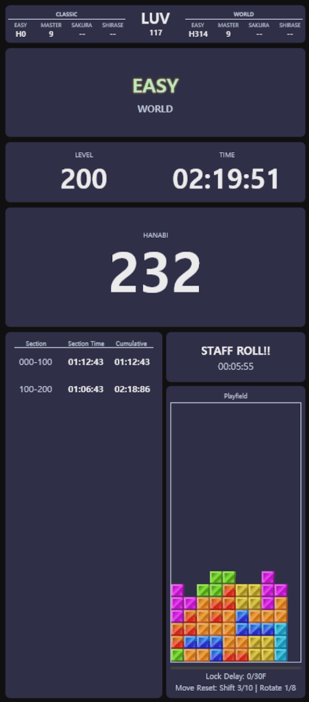
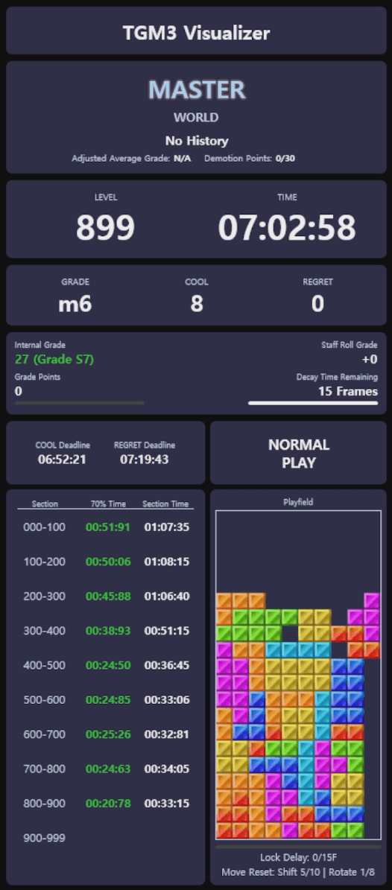
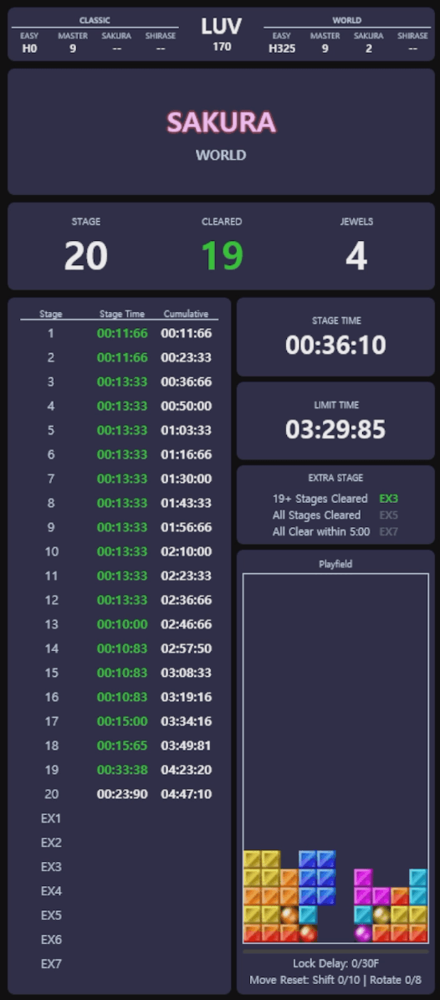
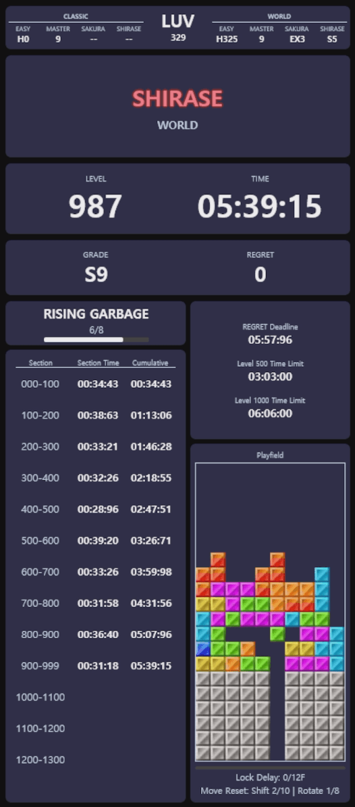

# TGM3 Visualizer

**Real-time memory visualization tool for Tetris: The Grand Master 3**

   

## Features
> **Note:** This tool only works when playing on Player 1's side.

- **Real-time visualization** — automatically finds the game process and reads memory at 16 ms intervals
- **Non-intrusive** — read-only access; never modifies or injects anything into the game process
- **Account Info** — displays player profile, decoration points, and grades at a glance
- **4 game mode dashboards** — dedicated visualizations for Easy, Master, Sakura, and Shirase modes
- **Playfield** — real-time board visualization (works even during invisible staff rolls!)
- **Lock Delay** — remaining lock delay indicator
- **Move Reset Counter** — tracks piece move resets before lock (World rule only)

## Account Info

The **PlayerInfoCard** is displayed across all game modes and provides a quick overview of your TGM3 account:

- **Nickname** — your 3-character in-game name
- **Decoration Points** — exact decoration point total
- **High Scores & Grades** — personal bests for all 4 game modes, shown in both **Classic** and **World** control modes

## Game Modes

### Easy Mode

A relaxed mode with straightforward level progression.

- **Level & Time** — current level and elapsed time
- **Hanabi Score** — real-time hanabi score display
- **Section Times** — 2 section time breakdowns

### Master Mode

The flagship competitive mode with a deep grading system and exam mechanics.

- **Grade History** — last 7 grades, with an adjusted average indicating your expected promotion grade
- **Demotion Progress** — shows how close you are to a demotion exam
- **Current Grade** — real-time grade display, ranging from 9 to GM
- **COOL / Regret** — real-time COOL and Regret status indicators
- **Internal Grade** — in-depth visualization of how the TGM3 Master Mode grading system works
- **Invisible Roll Qualification** — shows whether you qualify for the invisible roll
- **Exam Status** — indicates whether a promotion or demotion exam is in progress
- **Staff Roll** — staff roll progress tracking
- **Section Times** — 10 section time breakdowns; 70% time used for Section COOL detection, full section time for REGRET detection
- **Grade-up sound effects** — audio feedback when you achieve a new grade

### Sakura Mode

A puzzle-focused mode with 27 stages, jewel block objectives, and color-coded progress tracking.

- **Stage Timer & Limit** — current stage elapsed time and time limit
- **Jewel Block Tracking** — remaining jewel blocks
- **Stage Progression** — per-stage elapsed time and cumulative time
- **Extra Stage** — shows extra stage requirements, highlighted when fulfilled

### Shirase Mode

The ultimate challenge mode for elite players, featuring strict time limits and unique mechanics.

- **Grade System** — S1 through S13, with section regret count tracking 
- **Regret Deadline** — remaining time before regret is triggered
- **Level 500/1000 Time Limits** — countdown to each time limit (torikan)
- **Garbage Quota** — how close the garbage line is to rising
- **Section Times** — 13 section time breakdowns with section regret highlighting
- **Grade-up sound effects** — audio feedback when you achieve a new grade

## Disclaimer

This project is a **fan-made, educational tool** created for personal learning and non-commercial purposes only.

- **TGM3 Visualizer is not affiliated with, endorsed by, or connected to** Arika Co., Ltd., the developer and publisher of *Tetris: The Grand Master 3*.
- **Tetris** is a registered trademark of The Tetris Company, LLC. All game assets, names, and related imagery referenced in this project are the property of their respective owners.
- Use of this software is at your own risk. The author assumes no liability for any issues arising from its use.

## License

This project is licensed under the MIT License.
